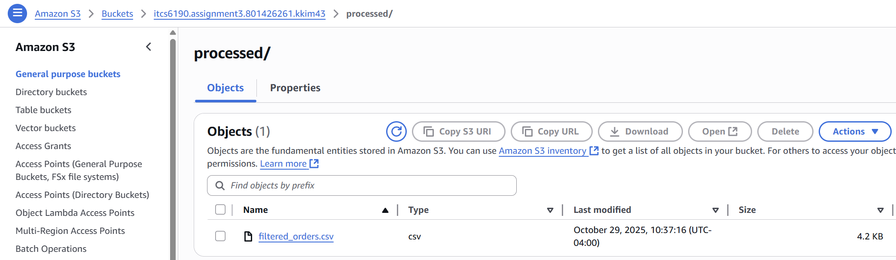
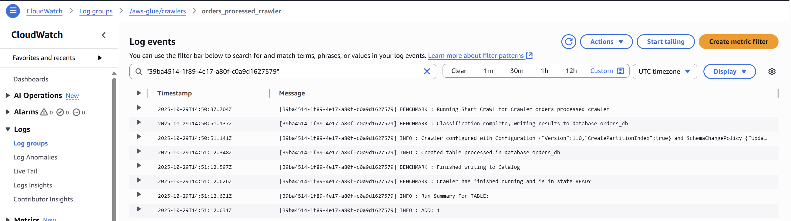
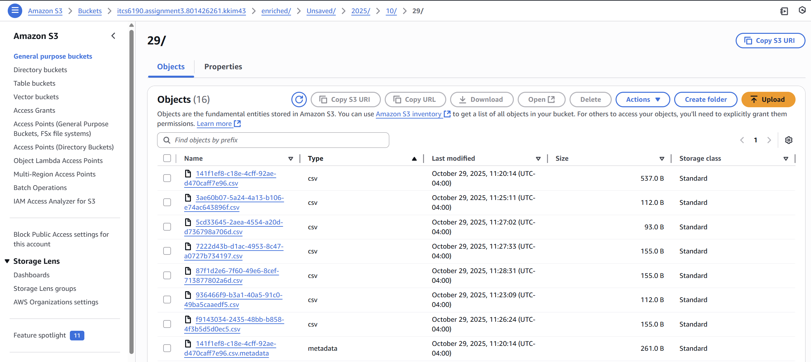
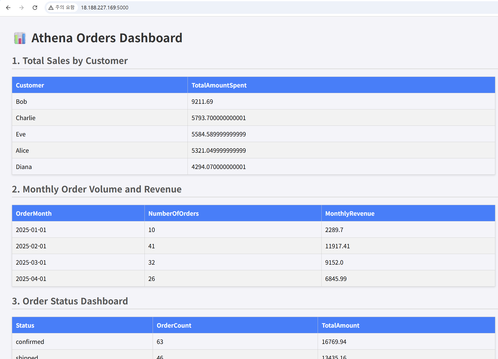

# ITCS-6190 Assignment 3: AWS Data Processing Pipeline

**Name (ID):** Kiyoung Kim (801426261)  
**E-Mail:** kkim43@charlotte.edu  

This project demonstrates an end-to-end serverless data processing pipeline on AWS.  
I built an automated workflow that collects, processes, and visualizes order data without manual intervention.  
The pipeline integrates Amazon S3 for storage, AWS Lambda for data processing, AWS Glue for cataloging, Amazon Athena for querying, and EC2 with Flask for dashboard visualization.

---

## 1. Amazon S3 Bucket Structure 🪣

**Approach:**  
I created an S3 bucket to organize the data lifecycle into three clear stages — raw input, processed output, and query results.

**Explanation:**  
The S3 bucket was named `itcs6190.assignment3.801426261.kkim43` and structured as follows:

```
├── raw/        # Original input data  
├── processed/  # Filtered output data from Lambda  
└── enriched/   # Athena query result storage  
```

This structure kept all files organized and allowed seamless integration between Lambda, Glue, and Athena.

**Screenshot:**  
📸 *Figure 1.* Amazon S3 Bucket Structure  


---

## 2. IAM Roles and Permissions 🔐

**Approach:**  
To ensure secure communication between AWS services, I created three IAM roles with specific access policies.

**Explanation:**  
- **Lambda-S3-Processing-Role-Assignment3** — allows Lambda to read and write S3 objects.  
- **Glue-S3-Crawler-Role-Assignment3** — allows Glue to crawl and catalog processed S3 data.  
- **EC2-Athena-Dashboard-Role-Assignment3** — allows EC2 to access Athena and S3 for dashboard visualization.

Each role was created using AWS managed policies, providing only the permissions required for each service.

**Screenshot:**  
📸 *Figure 2.* IAM Roles Created  


---

## 3. Create the Lambda Function ⚙️

**Approach:**  
I developed a Lambda function that automatically filters raw data whenever new files are uploaded to S3.

**Explanation:**  
The function, named `FilterAndProcessOrders`, reads CSV files from the `raw/` folder, filters out invalid or unnecessary records, and writes the cleaned output to the `processed/` folder.  
This automation ensures that all data entering the pipeline is pre-validated and ready for analysis.

**Screenshot:**  
📸 *Figure 3.* Lambda Function Created  


---

## 4. Configure the S3 Trigger ⚡

**Approach:**  
I connected the Lambda function to the S3 bucket using an event trigger, enabling automatic execution whenever new data arrives.

**Explanation:**  
Whenever a new CSV file is uploaded to the `raw/` folder, S3 automatically invokes the Lambda function, which processes and saves the output to `processed/`.  
This setup removes the need for manual intervention and guarantees consistent data processing.

**Screenshot:**  
📸 *Figure 4.* Configured S3 Trigger  


**Processed Data Output:**  
After uploading `Orders.csv`, the Lambda function was triggered automatically, producing a cleaned `filtered_orders.csv` file in the `processed/` folder.

**Screenshot:**  
📸 *Figure 5.* Processed CSV File in the `processed/` Folder on S3  


---

## 5. Create a Glue Crawler 🕸️

**Approach:**  
To make the processed data queryable in Athena, I configured an AWS Glue Crawler.

**Explanation:**  
The crawler scans the `processed/` folder, detects the schema, and automatically creates a table within the `orders_db` database.  
This enables Athena to access and query the dataset directly.

**Screenshot:**  
📸 *Figure 6.* AWS Glue Crawler Configuration and Run Result  


---

## 6. Query Data with Amazon Athena 🔍

**Approach:**  
After Glue completed the cataloging process, I used Amazon Athena to query and analyze the processed dataset.

**Explanation:**  
All queries were executed using the `orders_db` database and the `processed` table created by the crawler.  
These queries calculated total sales, monthly performance, customer averages, and the largest orders.

**Queries executed:**
1. Total Sales by Customer  
2. Monthly Order Volume and Revenue  
3. Order Status Dashboard  
4. Average Order Value per Customer  
5. Top 10 Largest Orders in February 2025  

Each query executed successfully, and the results were stored in the `enriched/` folder in S3 for later visualization.

**Screenshot:**  
📸 *Figure 7.* Athena Query Results and Output Files  


---

## 7. Launch the EC2 Web Server 🖥️

**Approach:**  
I launched an EC2 instance to host a lightweight Flask web application for visualizing Athena query results.

**Explanation:**  
The instance was created using Amazon Linux 2023 and assigned the `EC2-Athena-Dashboard-Role-Assignment3` IAM role for secure access to S3 and Athena.  
After connecting via SSH, I installed Python, Flask, and Boto3 to enable the web application environment.

---

## 8. Connect to the EC2 Instance

**Approach:**  
Once the EC2 instance was running, I connected to it via SSH using my downloaded key pair.

**Explanation:**  
The SSH connection provided direct access for configuring and deploying the Flask-based web application.

```bash
ssh -i "assignment3-key.pem" ec2-user@18.188.227.169
```

---

## 9. Set Up the Web Environment

**Approach:**  
I configured the EC2 environment to run the Flask application and connect it to AWS services.

**Explanation:**  
After updating the system, I installed Python 3, Pip, Flask, and Boto3.  
This prepared the environment for running the dashboard smoothly without dependency issues.

---

## 10. Create and Configure the Web Application

**Approach:**  
I built a Flask application that queries Athena and displays real-time analytics from the processed dataset.

**Explanation:**  
I created a file named `app.py`, copied the contents from `EC2InstanceNANOapp.py`, and updated configuration variables:
- AWS region  
- Athena database (`orders_db`)  
- S3 path for Athena query results (`s3://itcs6190.assignment3.801426261.kkim43/enriched/`)  

Once configured, the app connected to Athena using Boto3 and dynamically rendered the query results in a web dashboard.

---

## 11. Run the App and View the Dashboard 🚀

**Approach:**  
I ran the Flask application on the EC2 instance and viewed the results through a browser.

**Explanation:**  
Running `python3 app.py` launched the Flask server, and the dashboard became accessible via the EC2 public IP.  
The webpage displayed all Athena query outputs in a clean, tabular format.

**Screenshot:**  
📸 *Figure 8.* Final Web Dashboard — Athena Orders Results on EC2  


---

## Final Notes

- The pipeline successfully automates data ingestion, processing, and visualization using AWS’s core serverless tools.  
- Each stage — from Lambda processing to EC2 visualization — operates independently and securely.  
- To prevent unnecessary charges, all active resources, including the EC2 instance, were stopped after testing.
