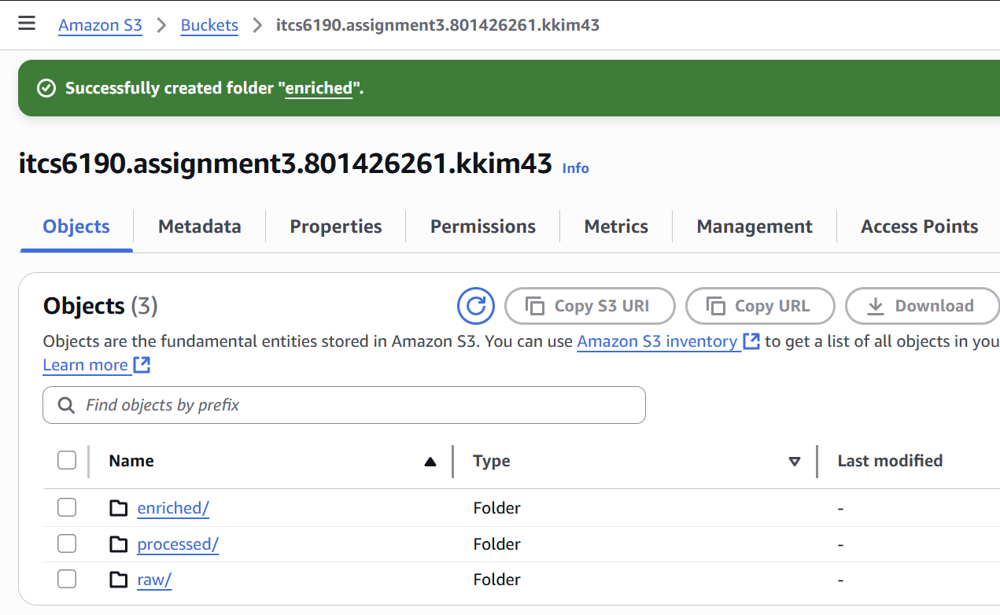
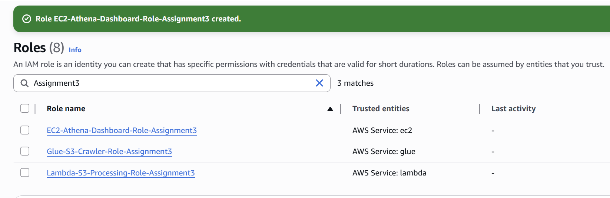
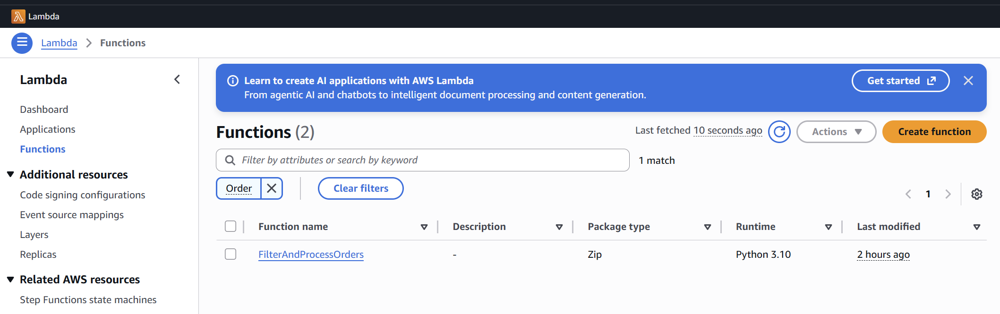
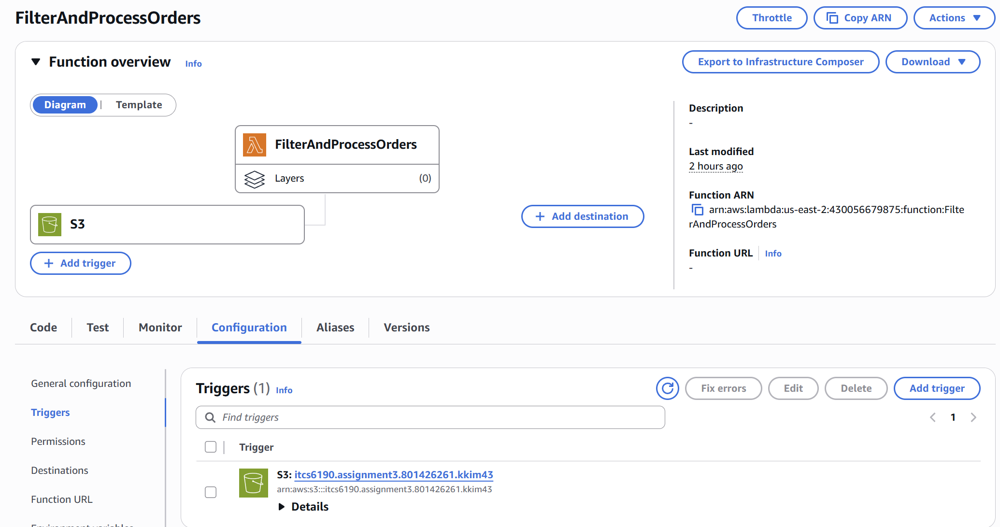

# ITCS-6190 Assignment 3: AWS Data Processing Pipeline

**Name(ID):** Kiyoung Kim (801426261)  
**E-Mail:** kkim43@charlotte.edu

This project demonstrates an end-to-end serverless data processing pipeline on AWS. The pipeline automates the flow of data from raw ingestion to visualization without manual intervention. Raw order data is uploaded to Amazon S3, automatically processed by an AWS Lambda function, cataloged using AWS Glue, queried through Amazon Athena, and finally visualized on a Flask-based web dashboard hosted on an EC2 instance.

## 1. Amazon S3 Bucket Structure 🪣

**Approach:**  
I created an S3 bucket to organize data into three main folders.  
Each folder has a clear purpose — the Lambda function reads from `raw/`, saves filtered files to `processed/`, and Athena saves query results to `enriched/`.

**Explanation:**  
The S3 bucket is named `itcs6190.assignment3.801426261.kkim43` and has the following structure:

```
├── raw/        # Raw data files uploaded here  
├── processed/  # Cleaned and filtered data from Lambda  
└── enriched/   # Athena query results stored here  
```

This setup keeps files tidy and makes it easy for Lambda, Glue, and Athena to work together.

**Screenshot:**  
📸 *Figure 1.* Amazon S3 Bucket Structure  


---
## 2. IAM Roles and Permissions 🔐

**Approach:**  
To let AWS services work together safely, I created three IAM roles — one for Lambda, one for Glue, and one for EC2.  
Each role has the right permissions so that every service can only do what it needs.

**Explanation:**  
- **Lambda-S3-Processing-Role-Assignment3**  
  - Used by: Lambda  
  - Policies: `AWSLambdaBasicExecutionRole`, `AmazonS3FullAccess`  

- **Glue-S3-Crawler-Role-Assignment3**  
  - Used by: AWS Glue  
  - Policies: `AmazonS3FullAccess`, `AWSGlueConsoleFullAccess`, `AWSGlueServiceRole`  

- **EC2-Athena-Dashboard-Role-Assignment3**  
  - Used by: EC2 instance  
  - Policies: `AmazonS3FullAccess`, `AmazonAthenaFullAccess`  

These roles make sure that Lambda can access S3, Glue can crawl the processed data, and EC2 can query Athena securely.

**Screenshot:**  
📸 *Figure 2.* IAM Roles Created  


---

## 3. Create the Lambda Function ⚙️

**Approach:**  
I created a Lambda function that automatically processes new files uploaded to the `raw/` folder in S3.  
This function reads the raw CSV file, filters it, and saves the cleaned version to the `processed/` folder.

**Explanation:**  
- **Function name:** `FilterAndProcessOrders`  
- **Runtime:** Python 3.9  
- **Role used:** `Lambda-S3-Processing-Role-Assignment3`  
- The code from `LambdaFunction.py` was uploaded to the Lambda editor.  
- The function filters out unnecessary rows and keeps only valid order data.

This automation removes the need for manual data cleaning and ensures consistent results every time a file is uploaded.

**Screenshot:**  
📸 *Figure 3.* Lambda Function Created  



---

## 4. Configure the S3 Trigger ⚡

**Approach:**  
To make the data flow automatic, I set up an S3 trigger that runs the Lambda function whenever a new CSV file is uploaded to the `raw/` folder.

**Explanation:**  
- **Source:** S3  
- **Bucket:** `itcs6190.assignment3.801426261.kkim43`  
- **Event type:** All object create events  
- **Prefix:** `raw/`  
- **Suffix:** `.csv`  
- The trigger ensures the Lambda function only runs when new CSV files appear in the `raw/` folder.  

Once set up, uploading `Orders.csv` automatically starts the Lambda process, which saves the filtered result to `processed/`.

**Screenshot:**  
📸 *Figure 4.* Configured S3 Trigger  



--- 
**Start Processing of Raw Data**: Now upload the Orders.csv file into the `raw/` folder of the S3 Bucket. This will automatically trigger the Lambda function.
---

## 5. Create a Glue Crawler 🕸️

The crawler will scan your processed data and create a data catalog, making it queryable by Athena.

1.  Navigate to the **AWS Glue** service.
2.  In the left pane, select **Crawlers** and click **Create crawler**.
3.  **Name**: `orders_processed_crawler`.
4.  **Data source**: Point the crawler to the `processed/` folder in your S3 bucket.
5.  **IAM Role**: Select the **Glue Service Role** you created earlier.
6.  **Output**: Click **Add database** and create a new database named `orders_db`.
7.  Finish the setup and run the crawler. It will create a new table in your `orders_db` database.

---

## 6. Query Data with Amazon Athena 🔍

Navigate to the **Athena** service. Ensure your data source is set to `AwsDataCatalog` and the database is `orders_db`. You can now run SQL queries on your processed data.

**Queries to be executed:**
* **Total Sales by Customer**: Calculate the total amount spent by each customer.
* **Monthly Order Volume and Revenue**: Aggregate the number of orders and total revenue per month.
* **Order Status Dashboard**: Summarize orders based on their status (`shipped` vs. `confirmed`).
* **Average Order Value (AOV) per Customer**: Find the average amount spent per order for each customer.
* **Top 10 Largest Orders in February 2025**: Retrieve the highest-value orders from a specific month.

---

## 7. Launch the EC2 Web Server 🖥️

This instance will host a simple web page to display the Athena query results.

1.  Navigate to the **EC2** service and click **Launch instance**.
2.  **Name**: `Athena-Dashboard-Server`.
3.  **Application and OS Images**: Select **Amazon Linux 2023 AMI**.
4.  **Instance type**: Choose **t2.micro** (Free tier eligible).
5.  **Key pair (login)**: Create and download a new key pair. **Save the `.pem` file!**
6.  **Network settings**: Click **Edit** and configure the security group:
    * **Rule 1 (SSH)**: Type: `SSH`, Port: `22`, Source: `My IP`.
    * **Rule 2 (Web App)**: Click **Add security group rule**.
        * Type: `Custom TCP`
        * Port Range: `5000`
        * Source: `Anywhere` (`0.0.0.0/0`)
7.  **Advanced details**: Scroll down and for **IAM instance profile**, select the **EC2 Instance Profile** you created.
8.  Click **Launch instance**.

---

## 8. Connect to Your EC2 Instance

1.  From the EC2 dashboard, select your instance and copy its **Public IPv4 address**.
2.  Open a terminal or SSH client and connect using your key pair:

    ```bash
    ssh -i /path/to/your-key-file.pem ec2-user@YOUR_PUBLIC_IP_ADDRESS
    ```

---

## 9. Set Up the Web Environment

Once connected via SSH, run the following commands to install the necessary software.

1.  **Update system packages**:
    ```bash
    sudo yum update -y
    ```
2.  **Install Python and Pip**:
    ```bash
    sudo yum install python3-pip -y
    ```
3.  **Install Python libraries (Flask & Boto3)**:
    ```bash
    pip3 install Flask boto3
    ```

---

## 10. Create and Configure the Web Application

1.  Create the application file using the `nano` text editor:
    ```bash
    nano app.py
    ```
2.  Copy and paste your Python web application code (`EC2InstanceNANOapp.py`) into the editor.

3.  ‼️ **Important**: Update the placeholder variables at the top of the script:
    * `AWS_REGION`: Your AWS region (e.g., `us-east-1`).
    * `ATHENA_DATABASE`: The name of your Glue database (e.g., `orders_db`).
    * `S3_OUTPUT_LOCATION`: The S3 URI for your Athena query results (e.g., `s3://your-athena-results-bucket/`).

4.  Save the file and exit `nano` by pressing `Ctrl + X`, then `Y`, then `Enter`.

---

## 11. Run the App and View Your Dashboard! 🚀

1.  Execute the Python script to start the web server:
    ```bash
    python3 app.py
    ```
    You should see a message like `* Running on http://0.0.0.0:5000/`.

2.  Open a web browser and navigate to your instance's public IP address on port 5000:
    ```
    http://YOUR_PUBLIC_IP_ADDRESS:5000
    ```
    You should now see your Athena Orders Dashboard!

---

## Important Final Notes

* **Stopping the Server**: To stop the Flask application, return to your SSH terminal and press `Ctrl + C`.
* **Cost Management**: This setup uses free-tier services. To prevent unexpected charges, **stop or terminate your EC2 instance** from the AWS console when you are finished.


